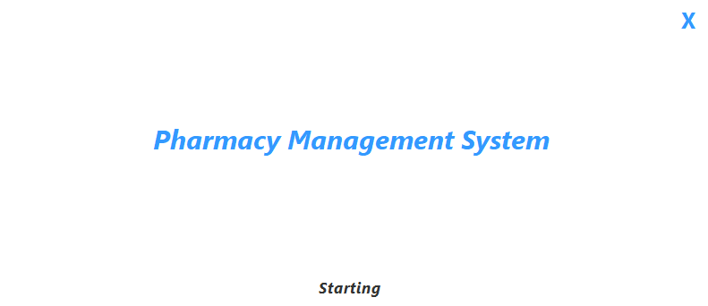
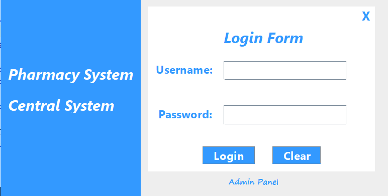
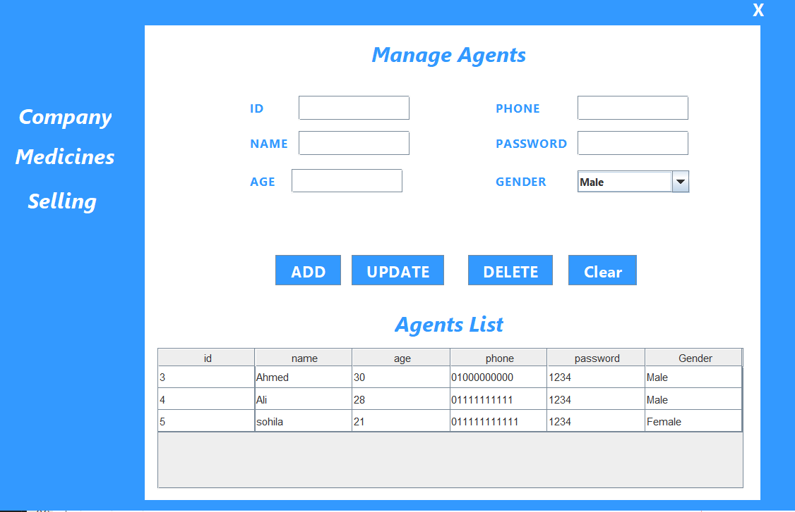
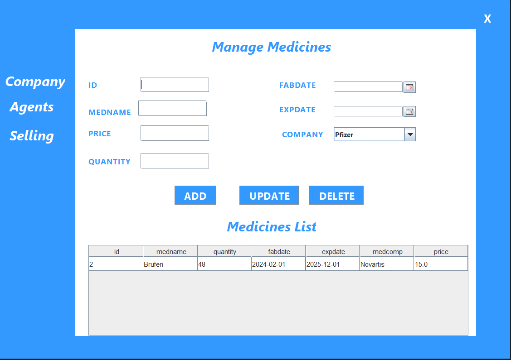
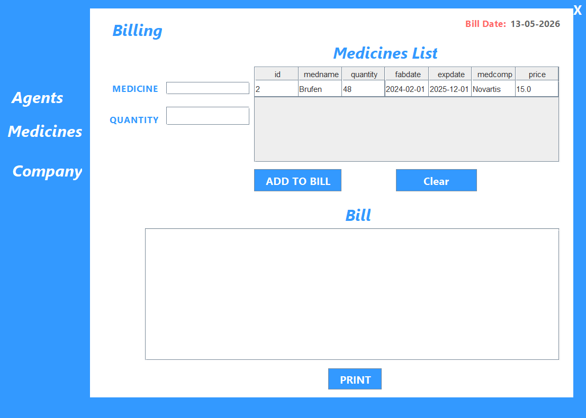
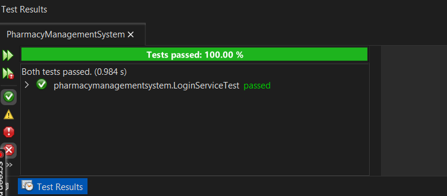

## 💊Pharmacy Management System

A desktop-based Pharmacy Management System developed using **Java**, **Java Swing**, and **SQL Server Database**.

The system helps manage pharmacy operations such as medicines, agents, companies, and selling processes through a simple and user-friendly interface.

## Features

- Secure Login System
- Medicine Management
  - Add Medicines
  - Update Medicines
  - Delete Medicines

- Agent Management
  - Add Agents
  - Edit Agent Information
  - Delete Agents

- Company Management
  - Add Companies
  - Update Company Data
  - Delete Companies

- Selling System
  - Create Medicine Bills
  - Automatically Update Medicine Quantity
  - Print Bills

- Splash Screen & User-Friendly UI

## Technologies Used

- Java
- Java Swing
- SQL Server
- JDBC
- JUnit
- NetBeans IDE

## Libraries Used

- `mssql-jdbc` → Database Connection
- `JUnit` → Login Testing
- `rs2xml` → Display Database Tables
- `JCalendar` → Date Selection

## Challenges Faced

One of the biggest challenges during development was connecting SQL Server with the Java application using JDK 21.

The issue was solved by:
- Updating SQL Server to a compatible version
- Enabling TCP/IP from SQL Server Configuration Manager
- Configuring localhost on port 1433
- Setting up SQL Server Authentication correctly
- Updating the JDBC connection settings

## My Role

- Team Leader
- Database Integration
- DB Connection Setup
- Login System Testing using JUnit
- Troubleshooting & Configuration
- UI color and font selection

## Project Screens

## splash

## login

## Agents

## Medicine Management

## Selling System

## testing login
